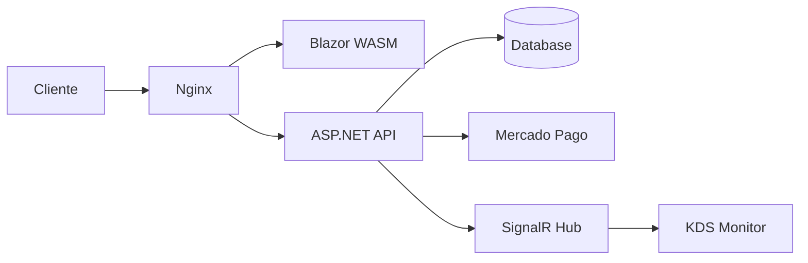

# Walkthrough Final — Projeto BatatasFritas

> Gerado pelo framework **Reversa** em 2026-05-01
> Cobertura: 85% do Core Business | Nível: Detalhado

Este documento consolida toda a análise de engenharia reversa realizada no projeto **BatatasFritas**. Ele serve como o "Mapa da Mina" para qualquer desenvolvedor ou agente de IA que venha a atuar no sistema.

---

## 1. Visão Geral do Sistema

O **BatatasFritas** é um sistema completo de gestão para um restaurante especializado em batatas fritas (Palheta Brutal). Ele abrange desde o cardápio digital (Delivery e Totem) até a gestão de cozinha (KDS), controle de estoque rigoroso e um sistema de fidelidade baseado em cashback.

### Stack Tecnológica
- **Backend**: .NET 8 (ASP.NET Core) + NHibernate 5.5 (ORM) + SQLite/PostgreSQL.
- **Frontend**: Blazor WebAssembly (.NET 8) + Vanilla CSS.
- **Real-time**: SignalR (WebSockets).
- **Integrações**: Mercado Pago (Pix e Point Smart 2) via Polly (Resiliência).
- **Infraestrutura**: Docker + Coolify + Nginx.

---

## 2. Arquitetura de Software

O sistema segue uma arquitetura multicamadas simplificada:
- **Domain**: Entidades ricas com lógica de negócio (Pedido, Produto, CarteiraCashback).
- **Infrastructure**: Repositório genérico e Unit of Work sobre NHibernate.
- **API**: Controllers REST e Hubs SignalR para orquestração.
- **Web**: SPA em Blazor WASM com gestão de estado em memória (`CarrinhoState`).

### Diagrama de Containers

---

## 3. Pilares de Negócio e Lógica Crítica

### A. O Ciclo do Pedido
Todo pedido nasce como `Recebido` e `Pagamento Pendente`. O sistema orquestra:
1. **Pré-check de estoque** (SQL direto por performance).
2. **Débito de Cashback** (se aplicável).
3. **Baixa de Estoque Automática** (com suporte a receitas complexas).
4. **Notificação Real-time** para a cozinha.

### B. Gestão de Estoque (Dual)
- **Produtos Simples**: Baixa direta no `EstoqueAtual` do produto. Desativação automática se zerar.
- **Produtos Compostos**: Baixa baseada em `Receitas` que consomem `Insumos`. Gera auditoria em `MovimentacaoEstoque`.

### C. Sistema de Cashback
O cliente acumula saldo apenas em produtos das categorias **Batatas** e **Porções**. O saldo é vinculado ao telefone e protegido contra valores negativos.

---

## 4. Integrações e Resiliência

- **Mercado Pago**: Implementa PIX Dinâmico e Checkout Pro.
- **Point Smart 2**: Utiliza **Polly** com retentativa exponencial (3x) para lidar com a instabilidade de hardware nas maquininhas.
- **Segurança**: Validação de webhooks via **HMAC-SHA256**.

---

## 5. Dívidas Técnicas e Lacunas (Backlog de Melhorias)

| Categoria | Descrição | Gravidade |
|---|---|---|
| **Segurança** | `AuthStateProvider` não persiste JWT — F5 desloga o usuário. | 🔴 Alta |
| **Integridade** | `MetodoPagamento` no serviço MP diverge do Enum no Domain. | 🔴 Alta |
| **Business** | Insumos podem ficar negativos sem alerta visual no dashboard. | 🟡 Média |
| **Arquitetura** | Uso de SQL puro em Controllers quebra a abstração do Repositório. | 🟡 Média |
| **Infra** | Migrações baseadas em `PRAGMA` (SQLite) podem falhar em PostgreSQL. | 🟡 Média |

---

## 6. Índice de Artefatos (SDD Folder)

Toda a documentação detalhada está em `_reversa_sdd/`:

### Estrutura e Dados
- [`inventory.md`](inventory.md): Inventário tecnológico completo.
- [`data-dictionary.md`](data-dictionary.md): Dicionário de dados de todas as tabelas.
- [`erd-complete.md`](erd-complete.md): Diagrama Entidade-Relacionamento.

### Lógica e Processos
- [`domain.md`](domain.md): 11 Regras de Negócio extraídas e Glossário.
- [`state-machines.md`](state-machines.md): Fluxos de status de Pedido e Pagamento.
- [`flowcharts/`](flowcharts/): Pasta com 15+ fluxogramas Mermaid detalhados.

### Especificações Executáveis (SDD)
- [`sdd/pedido.md`](sdd/pedido.md)
- [`sdd/pedidos-controller.md`](sdd/pedidos-controller.md)
- [`sdd/baixar-estoque.md`](sdd/baixar-estoque.md)
- [`sdd/mercadopago-service.md`](sdd/mercadopago-service.md)
- ... (outras 5 specs)

### Integração
- [`openapi/batatasfritas-api.yaml`](openapi/batatasfritas-api.yaml): Spec completa para testes e mocks.

---

## 7. Conclusão

O projeto BatatasFritas é uma aplicação madura, com regras de negócio bem definidas no código, mas com algumas inconsistências de arquitetura (leaks de SQL) e UX (persitência de login) que devem ser o foco das próximas sprints. A base de código está pronta para escala e para o uso de ferramentas de IA via o `MCP Server` configurado.

---
**Fim do Walkthrough.**
