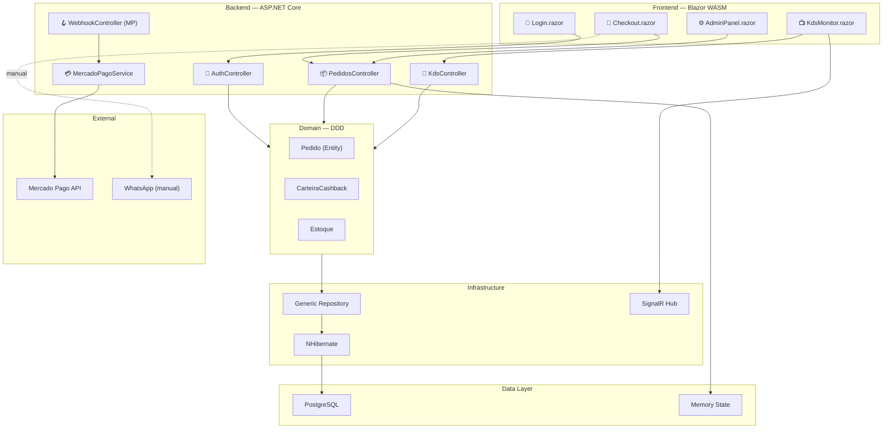
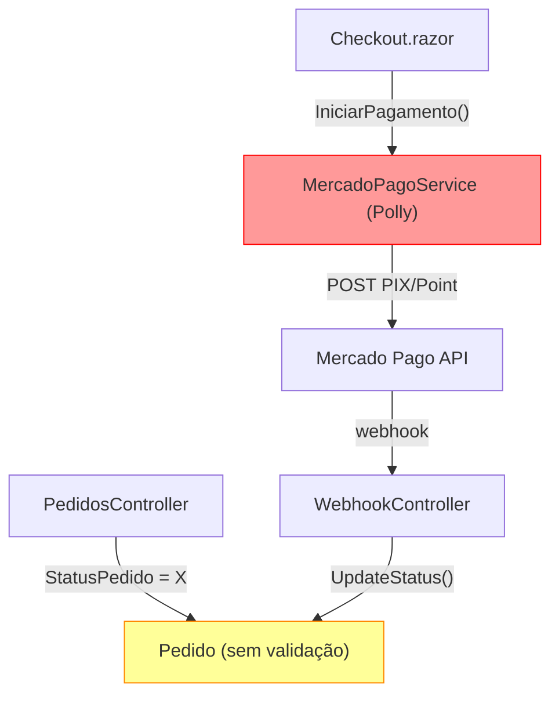
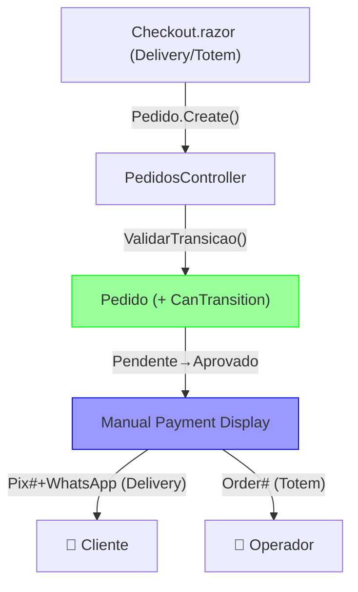

# Architecture — BatatasFritas FASE 3.5

> Análise + Upgrade: State Machine Validation + Manual Payment Flow
> Gerado em 2026-05-01 | Modo: AVALIAR + UPGRADE

---

## Visão Geral

BatatasFritas é um monolito modular .NET 8 (ASP.NET Core + Blazor WASM + NHibernate) especializado em gestão de restaurante com múltiplos canais (Delivery, Totem, Balcão). FASE 3.5 remove acoplamento com MercadoPago e implementa validação de state machine no Domain, simplificando para fluxo manual de pagamento onde operador/cliente aprovam via WhatsApp ou exibição de order #.

---

## Estado Atual

### Arquitetura Mapa


### Score Qualidade Arquitetural

| Dimensão | Nota | Observação |
|----------|------|-----------|
| **Manutenibilidade** | 3/5 | DDD + camadas claras, mas MercadoPago acoplado em Controllers |
| **Escalabilidade** | 3/5 | Monolito funciona até ~10k req/min. SignalR sem distribuição |
| **Observabilidade** | 2/5 | Logs sem estrutura. KDS sem timestamp/etapa. Payment não auditável |
| **Segurança** | 3/5 | JWT correto, HMAC em webhooks OK. Falha: AuthStateProvider não persiste (F5→logout) |
| **Testabilidade** | 2/5 | State machine sem contrato. Payment tightly coupled a MercadoPago |
| **Resiliência** | 2/5 | Polly retry em Point OK. Sem circuit breaker geral. Recusado → deadlock |
| **Total** | **2.7/5** | Funcional, mas dívida técnica em state + payment impede escala |

### Dívidas Técnicas (Priorizadas)

| Problema | Gravidade | Área | Esforço |
|----------|-----------|------|---------|
| StatusPedido sem validação de transições | 🔴 Alta | Domain | 2–3 dias |
| MercadoPagoService acoplado em Controllers | 🔴 Alta | API | 3–5 dias |
| AuthStateProvider não persiste (F5 logout) | 🔴 Alta | Blazor/UX | 1 dia |
| StatusPagamento.Recusado sem retry → deadlock | 🟡 Média | Domain | 1–2 dias |
| KDS sem timestamp/stage → sem métricas | 🟡 Média | KDS | 2–3 dias |
| CarteiraCashback late update → race condition | 🟡 Média | Domain | 1 dia |
| SQL puro em Controllers quebra Repo abstração | 🟡 Média | API | 1–2 dias |
| CORS aberto em dev | 🟡 Média | Segurança | < 1 dia |

### Pontos Fortes

✅ DDD aplicado corretamente — Entidades ricas com lógica. Domain-first, Controllers orquestram.  
✅ NHibernate + Repository pattern — Abstração BD sólida. Unit of Work coeso.  
✅ SignalR real-time — KDS responsivo, pedidos chegam < 500ms.  
✅ Múltiplos fluxos de pagamento — PIX + Point Smart 2 integrados.  
✅ Blazor WASM — Frontend type-safe, reutiliza Domain models. Auth JWT stateless.  
✅ Migrations versionadas (FluentMigrator) — Rollback seguro, histórico auditável.

### Principais Riscos

🔴 **State machine deadlock** — Pedido.Recusado sem retry automático → operador deve corrigir. Sob carga: perdidos.  
🔴 **F5 logout** — Token em memória, não localStorage. Admin F5 → deslogado. Produção crítica.  
🟡 **MercadoPago removal blindness** — Remover MercadoPagoService sem auditar callsites → runtime error em Checkout.  
🟡 **Payment audit trail loss** — Sem Recusado/retry, histórico de tentativas desaparece. Compliance risk.  
🟡 **SignalR stickiness** — Sem Redis backplane, múltiplas instâncias → KDS updates perdidas.

---

## Upgrade: Antes vs. Depois

### ANTES (Estado Atual)


### DEPOIS (Proposto)


---

## Estratégia de Migração

**Branch by Abstraction** (safest para monolito produção):

1. Criar `IPaymentService` (abstração) — MercadoPago + Manual implementam.
2. `Pedido.CanTransition()` — novo método Domain, Controllers consultam primeiro.
3. `Checkout.razor` — branch lógica: if (Delivery) → Pix#+WhatsApp else Order#.
4. `MercadoPagoService` → marked obsolete. Remover calls gradualmente.
5. Merge + cleanup — deletar MercadoPagoService, WebhookController, MercadoPagoOptions DI.

**Razão:** Zero downtime, rollback fácil se quebrar.

---

## Plano Migração por Fases

### Fase 1 — State Machine Foundation (2 dias)
- **Objetivo:** Parar transições inválidas no Domain.
- **Mudanças:**
  - Adicionar `Pedido.CanTransition(newStatus) → bool` (valida máquina estado).
  - Update `PedidosController.UpdateStatus()` → `if (!pedido.CanTransition(newStatus)) throw InvalidOperationException`.
  - Add testes: `PedidoStateTransitionTests` (Recebido→Aceito OK, Entregue→Aceito FAIL, etc).
- **Risco:** Baixo. Lógica pura, não afeta fluxo.
- **Critério sucesso:** Testes passam. Controller rejeita transições inválidas.
- **Esforço:** ~6 horas.

### Fase 2 — Payment Abstraction (2–3 dias)
- **Objetivo:** Desacoplar Checkout de MercadoPago.
- **Mudanças:**
  - Criar `IPaymentService` + `MercadoPagoPaymentService` + `ManualPaymentService`.
  - Refatorar `Checkout.razor` → remove `MercadoPagoService` calls. Use `IPaymentService` injetado.
  - `StatusPagamento`: simplificar (Pendente, Aprovado, Cancelado). Remover Recusado.
  - `Pedido.StatusPagamento` → apenas exibição para UI.
- **Risco:** Médio. Múltiplos callsites. Testar checkout end-to-end.
- **Critério sucesso:** Checkout renderiza sem erros. Manual payment funciona (Delivery: Pix#+WhatsApp, Totem: Order#).
- **Esforço:** ~18 horas.

### Fase 3 — MercadoPago Removal (1–2 dias)
- **Objetivo:** Deletar código morto.
- **Mudanças:**
  - Delete `MercadoPagoService.cs`, `WebhookController.cs`.
  - Remove DI: `services.AddMercadoPago()`, Mercado Pago config.
  - Remove `MercadoPagoOptions` + `appsettings.json` MP settings (keep Auth JWT).
  - Clean SDD: `mercadopago-service.md` → mark deprecated, link `pagamento-manual.md`.
- **Risco:** Baixo. Tudo deletado já não está em uso.
- **Critério sucesso:** Solution compila. Testes passam. No dangling references.
- **Esforço:** ~4 horas.

### Fase 4 — Auth Persistence (Opcional — próxima sprint)
- **Objetivo:** Fix F5 logout (documentar, não escopo FASE 3.5).
- **Mudanças:** `AuthStateProvider.MarkUserAsAuthenticated()` → persist token em `localStorage`.
- **Esforço:** ~2 horas (fácil, requer Blazor WASM security review).

---

## Quick Wins (< 1 dia, alto impacto)

| Win | O que faz | Esforço |
|-----|-----------|---------|
| CORS lockdown | Remover AllowAnyOrigin. Set `AllowCredentials = true` + list origins. | < 30 min |
| StatusPedido enum comment | Documentar máquina estado válida em código. | < 30 min |
| MercadoPagoService deprecation | Mark `[Obsolete]` com mensagem. | < 15 min |
| Webhook disable | Comment-out route binding. Deixar arquivo (facilita rollback). | < 15 min |
| Payment display test | Unit test: Checkout renderiza Pix#+WhatsApp (Delivery), Order# (Totem). | < 1 hora |

---

## Respostas às Perguntas Arquiteturais

### 1. State Machine Logic → `Pedido.CanTransition()` no Domain?

✅ **Sim. `Pedido.CanTransition(newStatus) → bool` no Domain (entidade).**

**Porquê:**
- DDD: lógica de negócio (máquina estado) vive na entidade, não em serviço.
- Controllers consultam `if (pedido.CanTransition(newStatus))` antes de atualizar.
- Testável isoladamente: sem mockar repositório.
- `ValidarTransicao()` (void) menos idiomatic que `CanTransition()` (bool).

### 2. Payment Storage → `StatusPagamento.Recusado` + Polly, ou remover?

✅ **Remover `Recusado` completamente. Simplificar: `Pendente → Aprovado` (manual).**

**Porquê:**
- Manual payment = operador aprova no WhatsApp/ordem.
- Sem Polly = sem retry automático = sem deadlock.
- Recusado hoje → sem fluxo de retry definido.
- Menos estado = menos bugs.

### 3. Blazor Checkout → remover `MercadoPagoService`, exibir Pix#+WhatsApp?

✅ **Sim. Checkout renderiza output apenas (visual-only).**

**Padrão:**
```csharp
@if (pedido.TipoEntrega == "Delivery")
{
    <div>Pix: 123.456.789</div>
    <button @onclick="AbrirWhatsApp">Enviar Comprovante</button>
}
else if (pedido.TipoEntrega == "Totem")
{
    <div>Pedido #@pedido.Id</div>
}
```

Sem `await mpService.IniciarPagamento()`. Sem API calls. Checkout retorna `Pedido.StatusPagamento = Pendente` imediatamente.

---

## Requisitos Não-Funcionais

| Tipo | Requisito | Evidência | Confiança |
|------|-----------|-----------|-----------|
| Compatibilidade UX | Checkout UX idêntica ao original | User constraint ("Checkout UX idêntica ao original") | 🟢 |
| Performance | State machine validation < 10ms | `Pedido.CanTransition()` é O(1) — array lookup | 🟢 |
| Segurança | CORS restrictivo | Remover AllowAnyOrigin | 🟢 |
| Auditoria | Payment history logging | Cada transição registrada em Domain event | 🟡 |
| Escalabilidade | Sem externa dependency (pagamento) | Manual flow não depende de MercadoPago API uptime | 🟢 |

---

## Próximos Passos (Ordem Recomendada)

1. ✅ **Esse documento** — arquitetura + decisões.
2. 📋 **SDD Spec** — gerar 3 specs (pedido-state-machine.md, pagamento-manual.md, remocao-mercadopago.md).
3. 🎯 **SandecoMaestro** — orquestrar squad across 3 ambientes paralelos.
4. 🔐 **Security Review** — auditar payment system changes (auth, data storage).
5. 🛠️ **Implementação** — Fase 1 → 2 → 3 conforme spec aprovadas.

---

**Status:** PRONTO PARA SPECS.
**Revisor:** software-architecture skill.
**Data:** 2026-05-01.
