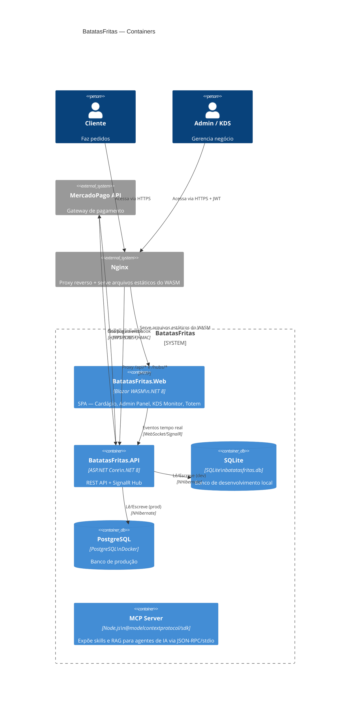
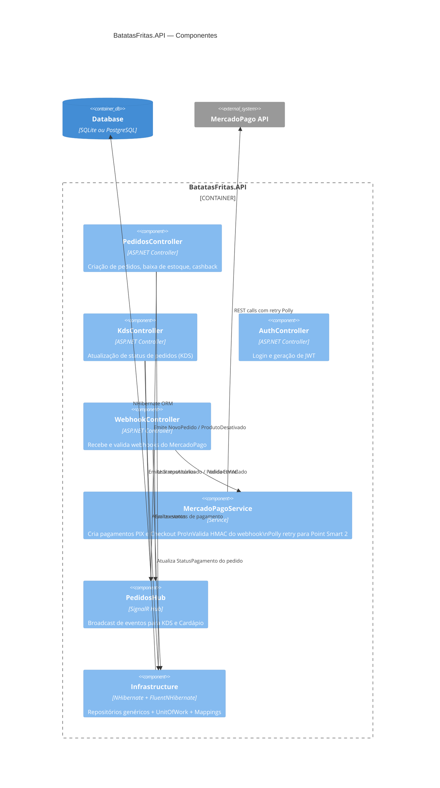

# Arquitetura C4 — Containers (Nível 2)

> Gerado pelo Reversa (Arquiteto) em 2026-05-01 | Nível: Detalhado

# Arquitetura C4 — Componentes (Nível 3)

> Componentes da API (container mais crítico)

