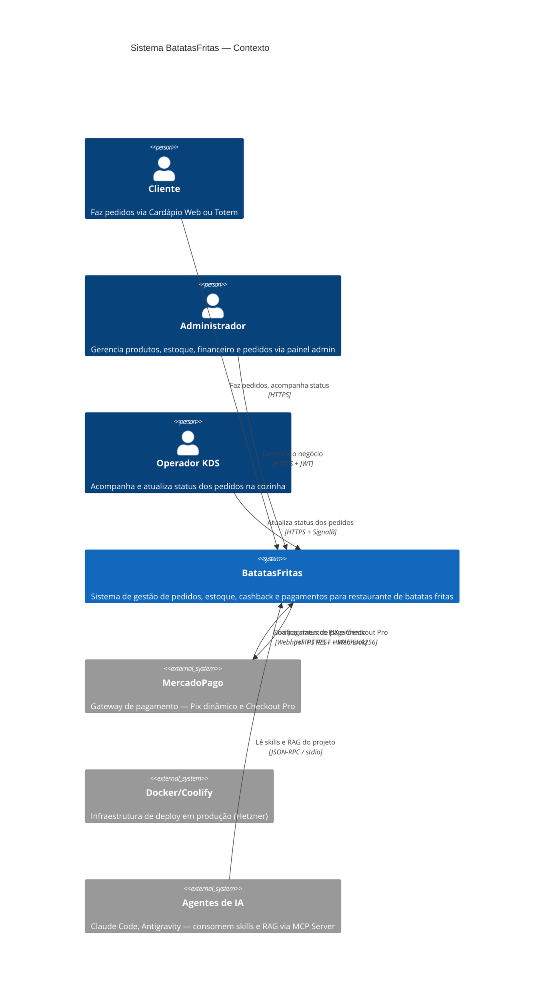

# Arquitetura C4 — Contexto (Nível 1)

> Gerado pelo Reversa (Arquiteto) em 2026-05-01 | Nível: Detalhado

```mermaid
C4Context
    title Sistema BatatasFritas — Contexto

    Person(cliente, "Cliente", "Faz pedidos via Cardápio Web ou Totem")
    Person(admin, "Administrador", "Gerencia produtos, estoque, financeiro e pedidos via painel admin")
    Person(operador, "Operador KDS", "Acompanha e atualiza status dos pedidos na cozinha")

    System(batatasfritas, "BatatasFritas", "Sistema de gestão de pedidos, estoque, cashback e pagamentos para restaurante de batatas fritas")

    System_Ext(mercadopago, "MercadoPago", "Gateway de pagamento — Pix dinâmico e Checkout Pro")
    System_Ext(docker, "Docker/Coolify", "Infraestrutura de deploy em produção (Hetzner)")
    System_Ext(mcp, "Agentes de IA", "Claude Code, Antigravity — consomem skills e RAG via MCP Server")

    Rel(cliente, batatasfritas, "Faz pedidos, acompanha status", "HTTPS")
    Rel(admin, batatasfritas, "Gerencia o negócio", "HTTPS + JWT")
    Rel(operador, batatasfritas, "Atualiza status dos pedidos", "HTTPS + SignalR")
    Rel(batatasfritas, mercadopago, "Cria pagamentos PIX e Checkout Pro", "HTTPS REST + Webhook")
    Rel(mercadopago, batatasfritas, "Notifica status de pagamento", "Webhook HTTPS + HMAC-SHA256")
    Rel(mcp, batatasfritas, "Lê skills e RAG do projeto", "JSON-RPC / stdio")
```
