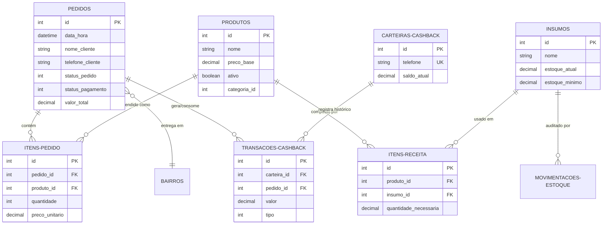

# ERD — BatatasFritas

> Gerado pelo Reversa Data Master em 2026-05-01
> Visualização Mermaid

```mermaid
erDiagram
    PEDIDOS ||--o{ ITENS-PEDIDO : "contém"
    PEDIDOS }o--|| BAIRROS : "entrega em"
    PEDIDOS ||--o{ TRANSACOES-CASHBACK : "gera/consome"
    
    PRODUTOS ||--o{ ITENS-PEDIDO : "vendido como"
    PRODUTOS ||--o{ ITENS-RECEITA : "composto por"
    
    INSUMOS ||--o{ ITENS-RECEITA : "usado em"
    INSUMOS ||--o{ MOVIMENTACOES-ESTOQUE : "auditado por"
    
    CARTEIRAS-CASHBACK ||--o{ TRANSACOES-CASHBACK : "registra histórico"
    
    PEDIDOS {
        int id PK
        datetime data_hora
        string nome_cliente
        string telefone_cliente
        int status_pedido
        int status_pagamento
        decimal valor_total
    }

    ITENS-PEDIDO {
        int id PK
        int pedido_id FK
        int produto_id FK
        int quantidade
        decimal preco_unitario
    }

    PRODUTOS {
        int id PK
        string nome
        decimal preco_base
        boolean ativo
        int categoria_id
    }

    INSUMOS {
        int id PK
        string nome
        decimal estoque_atual
        decimal estoque_minimo
    }

    ITENS-RECEITA {
        int id PK
        int produto_id FK
        int insumo_id FK
        decimal quantidade_necessaria
    }

    CARTEIRAS-CASHBACK {
        int id PK
        string telefone UK
        decimal saldo_atual
    }

    TRANSACOES-CASHBACK {
        int id PK
        int carteira_id FK
        int pedido_id FK
        decimal valor
        int tipo
    }
```
