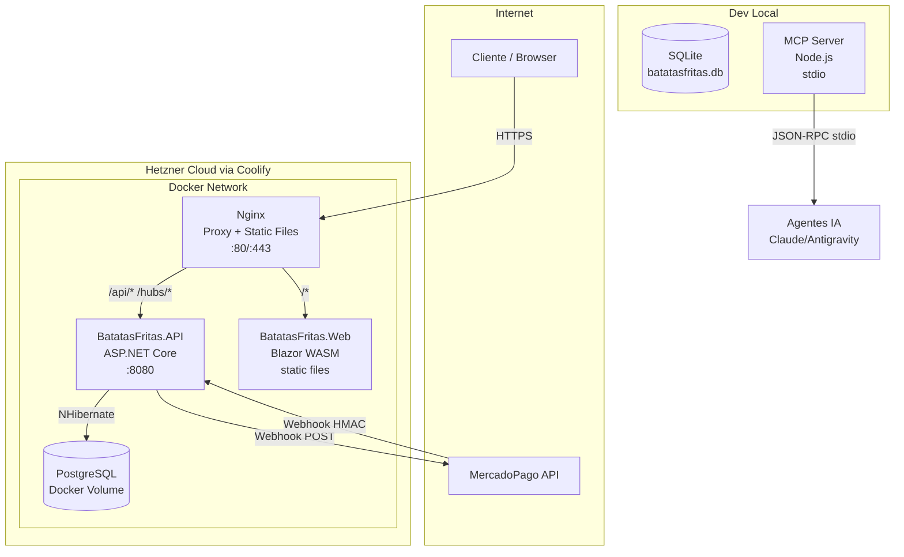

# Deployment — BatatasFritas

> Gerado pelo Reversa (Arquiteto) em 2026-05-01 | Nível: Detalhado

## Infraestrutura de Produção



## Configuração Docker

### `docker-compose.yml` (desenvolvimento)
```yaml
# Serviços: API + PostgreSQL
# Sem Nginx em dev — API exposta diretamente
```

### `docker-compose.prod.yml` (produção)
```yaml
# Serviços: API + PostgreSQL + Nginx
# Nginx serve o WASM compilado e faz proxy da API
```

## CI/CD

| Etapa | Arquivo | Descrição |
|---|---|---|
| Build Base Image | `.github/workflows/build-base-image.yml` | Constrói a imagem Docker base com wasm-tools pré-instalado (evita OOM no Coolify) |
| Deploy | Manual via Coolify | Deploy por webhook/push no Coolify (inferido) |

## Variáveis de Ambiente Críticas

| Variável | Onde | Uso |
|---|---|---|
| `ConnectionStrings:DefaultConnection` | appsettings.json / Docker env | String de conexão SQLite ou PostgreSQL |
| `DatabaseProvider` | appsettings.json / Docker env | `sqlite` ou `postgres` |
| `Jwt:SecretKey` | appsettings.json / Docker env | Chave de assinatura JWT |
| `Jwt:Issuer` / `Jwt:Audience` | appsettings.json | Validação do token |
| `MercadoPago:AccessToken` | appsettings.json / Docker env | Token de API do MercadoPago |
| `MercadoPago:NotificationUrl` | appsettings.json | URL pública para receber webhooks |
| `MercadoPago:WebhookSecret` | appsettings.json | Chave HMAC para validar webhooks |
| `MercadoPago:DeviceId` | appsettings.json | ID do dispositivo Point Smart 2 |

## Observações de Deploy

🟡 **wasm-tools OOM:** O Blazor WASM requer o workload `wasm-tools` para publicar. Em servidores com memória limitada, isso causa OOM durante o build. Solução implementada: imagem base pré-compilada com wasm-tools.

🟢 **SchemaUpdate automático:** O NHibernate cria/atualiza tabelas no startup — não requer migration manual.

🟡 **Nginx e Brotli:** Commit `43b5e78` corrigiu tela branca causada por Nginx sem `Content-Encoding` correto para arquivos Brotli/Gzip do Blazor WASM. Verificar se `nginx.conf` está configurado corretamente para compressão.
