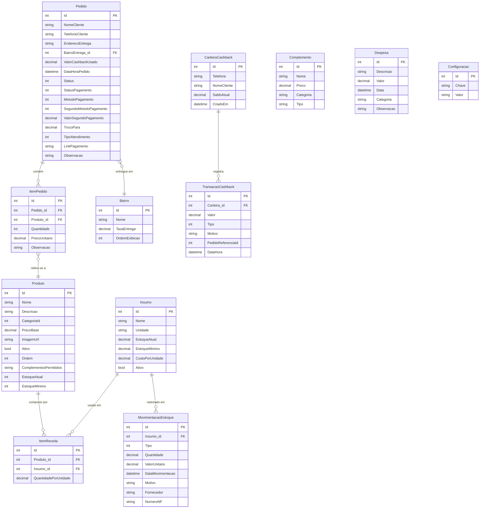

# ERD Completo — BatatasFritas

> Gerado pelo Reversa (Arquiteto) em 2026-05-01 | Nível: Detalhado

## Relacionamentos com Cardinalidades

| Entidade A | Cardinalidade | Entidade B | Notas |
|---|---|---|---|
| Pedido | 1:N | ItemPedido | Cascade delete |
| ItemPedido | N:1 | Produto | Snapshot de preço — produto pode mudar |
| Pedido | N:1 | Bairro | Nullable — Balcão/Totem não têm bairro |
| CarteiraCashback | 1:N | TransacaoCashback | Histórico completo de saldo |
| Produto | N:M | Insumo | Via ItemReceita |
| Insumo | 1:N | MovimentacaoEstoque | Rastreabilidade de estoque |
