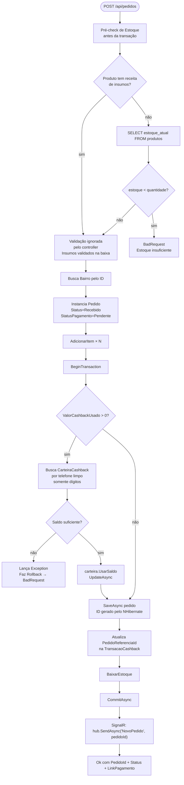
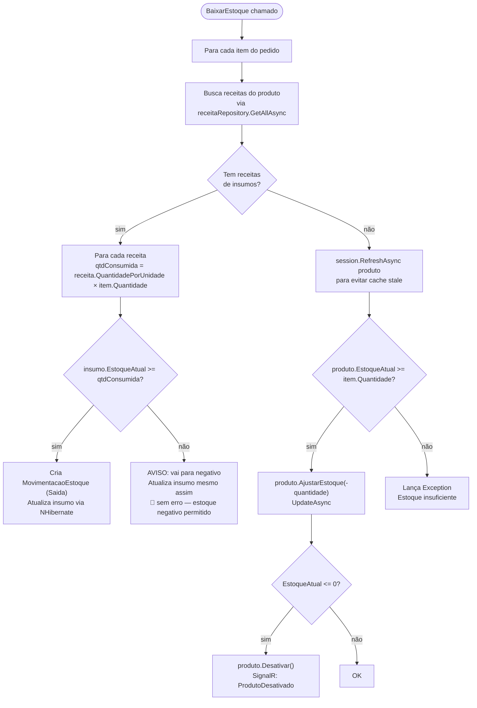
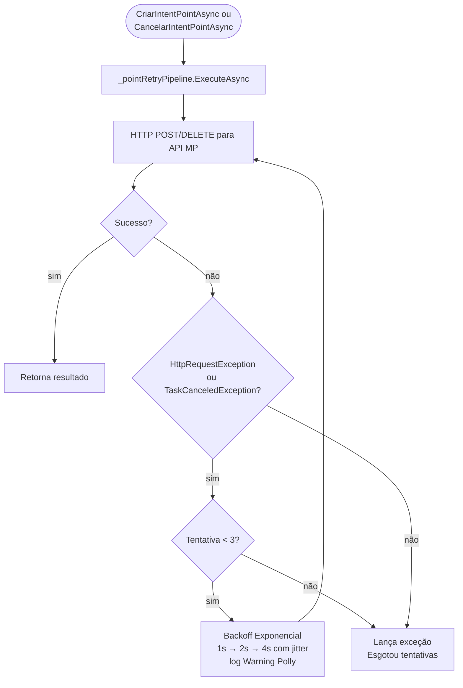
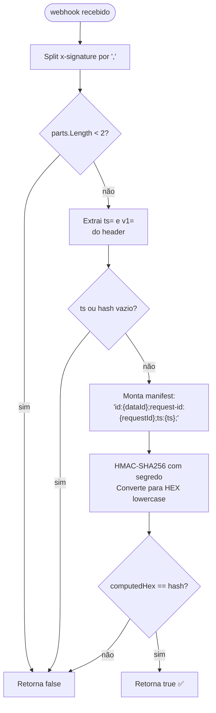

# Fluxograma — BatatasFritas.API

> Gerado pelo Reversa (Arqueólogo) em 2026-05-01 | Nível: Detalhado

## Fluxo Completo: POST /api/pedidos

## Fluxo: BaixarEstoque (função privada)

## Fluxo: MercadoPagoService — Polly Retry (Point Smart 2)

## Fluxo: ValidarAssinaturaWebhook (HMAC-SHA256)

## SignalR: Eventos Emitidos pelo Servidor

| Evento | Payload | Quando |
|---|---|---|
| `NovoPedido` | `pedidoId: int` | Pedido criado com sucesso |
| `StatusAtualizado` | `pedidoId: int, novoStatus: string` | KDS atualiza status |
| `PedidoCancelado` | `pedidoId: int` | Pedido cancelado |
| `ProdutoDesativado` | `produtoId: int` | Estoque zerado automaticamente |
