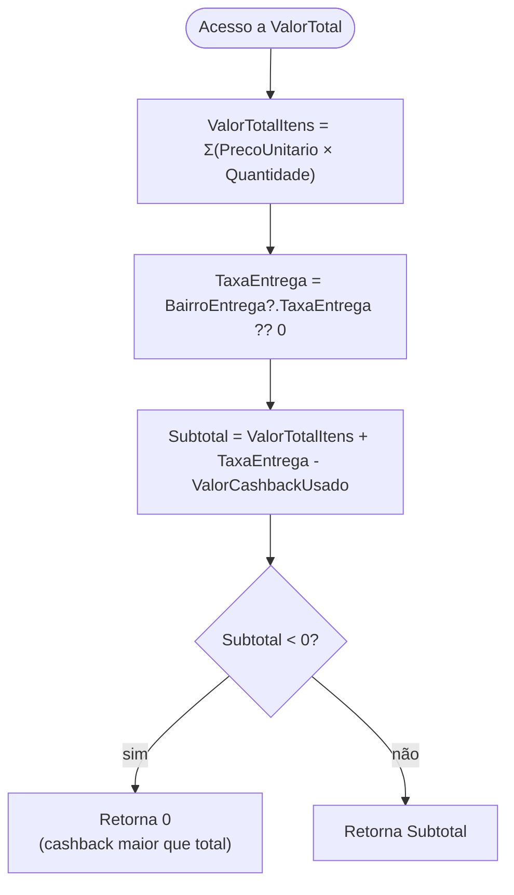
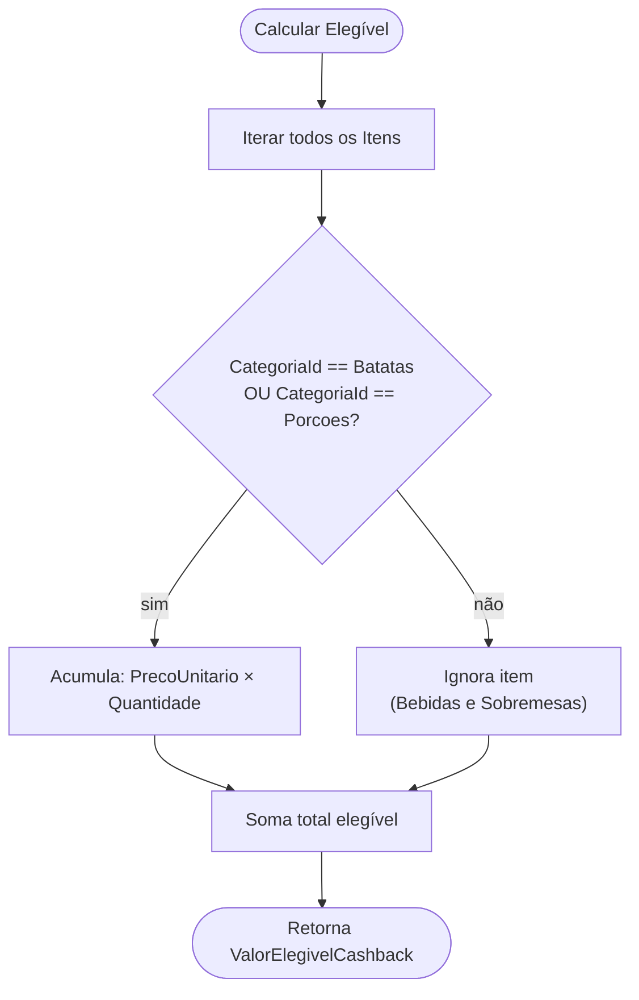
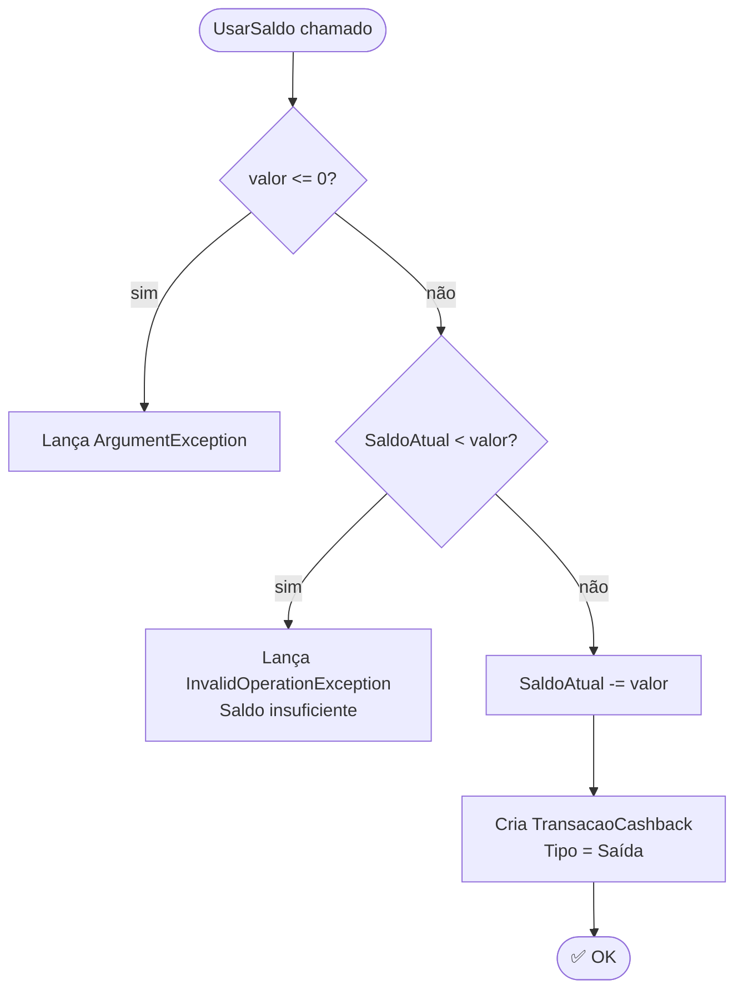
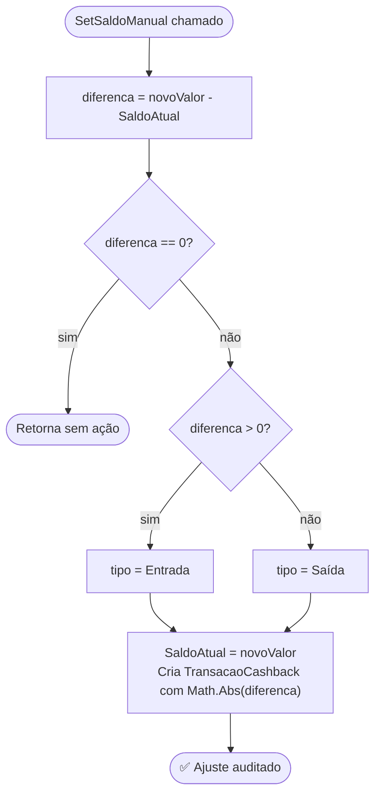

# Fluxograma por Função — Pedido.ValorTotal

> Nível Detalhado: fluxograma por função principal com lógica não-trivial

## `Pedido.ValorTotal` — Cálculo Final com Proteção Negativa

## `Pedido.ValorElegivelCashback` — Filtro por Categoria

## `CarteiraCashback.UsarSaldo` — Guard Clauses

## `CarteiraCashback.SetSaldoManual` — Ajuste Auditável

