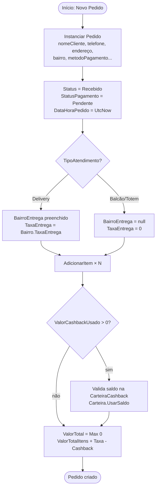
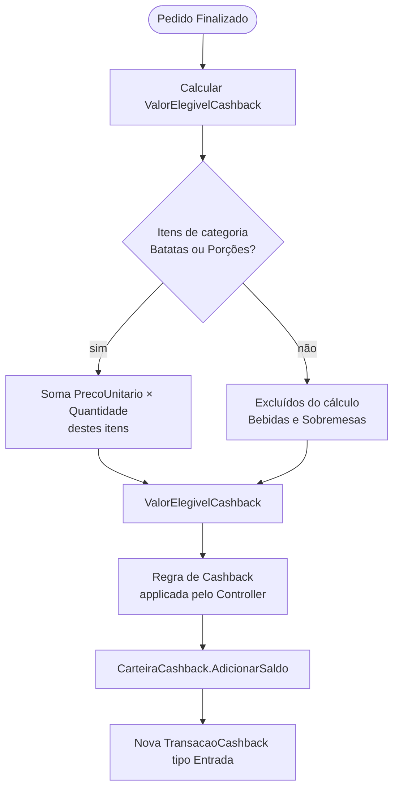
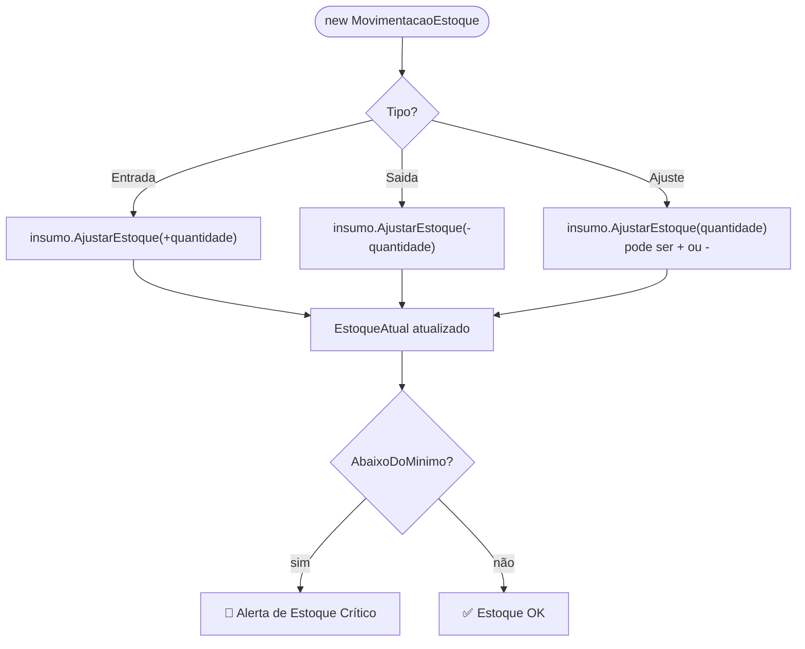
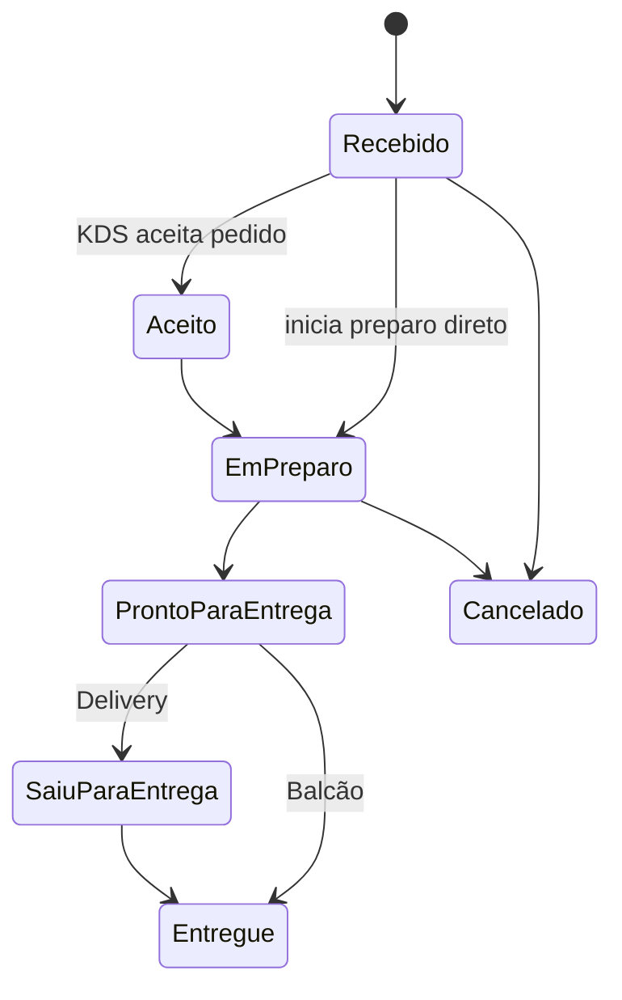
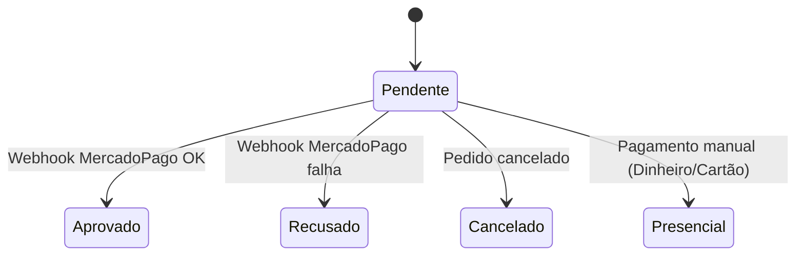

# Fluxograma — BatatasFritas.Domain

> Gerado pelo Reversa (Arqueólogo) em 2026-05-01 | Nível: Detalhado

## Fluxo de Criação de Pedido (Domain)

## Fluxo de Cálculo de Cashback (Domain)

## Fluxo de Movimentação de Estoque (Domain)

## Fluxo de Máquina de Estados — StatusPedido

## Fluxo de Máquina de Estados — StatusPagamento

