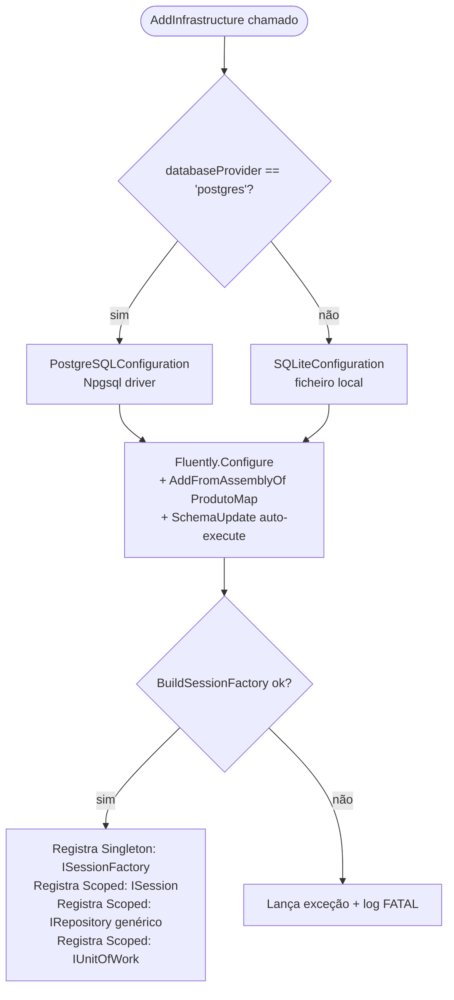
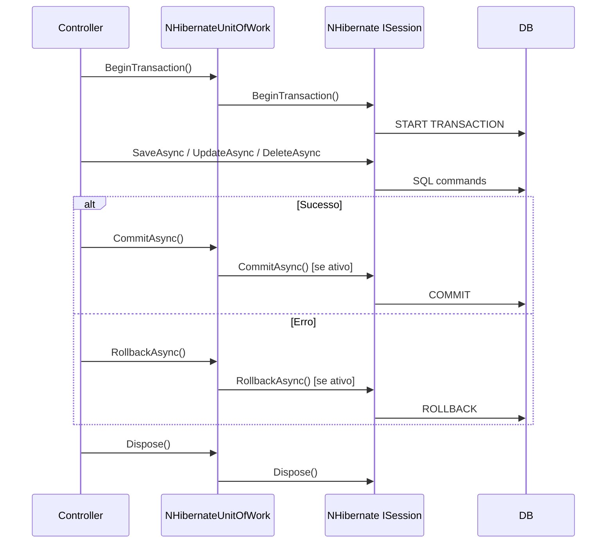
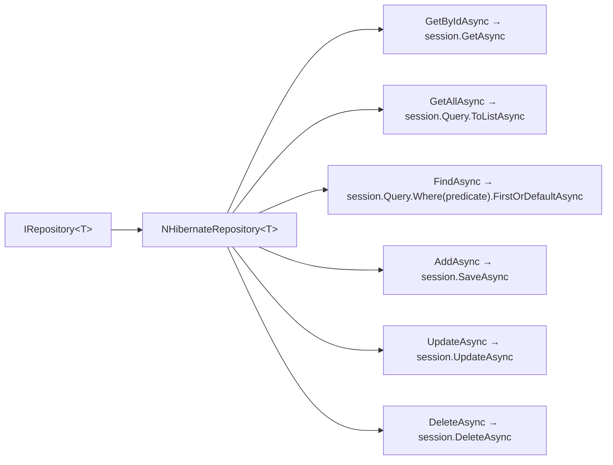

# Fluxograma — BatatasFritas.Infrastructure

> Gerado pelo Reversa (Arqueólogo) em 2026-05-01 | Nível: Detalhado

## Configuração da SessionFactory (DependencyInjection)

## Fluxo de Transação — UnitOfWork

## Repositório Genérico — NHibernateRepository

