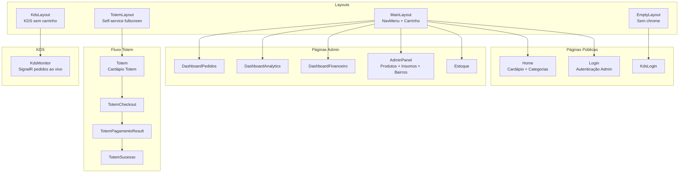
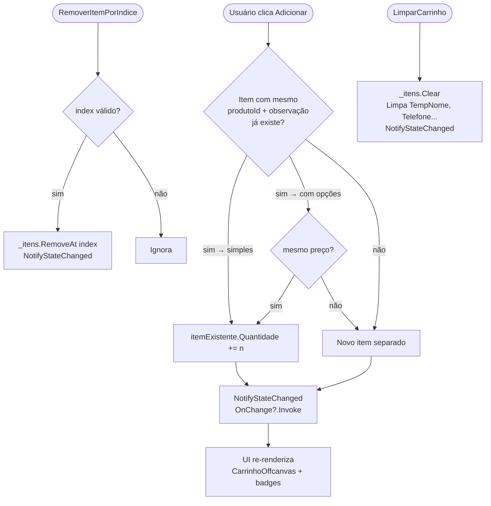
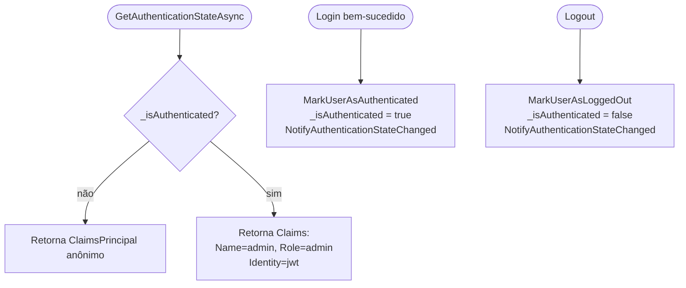
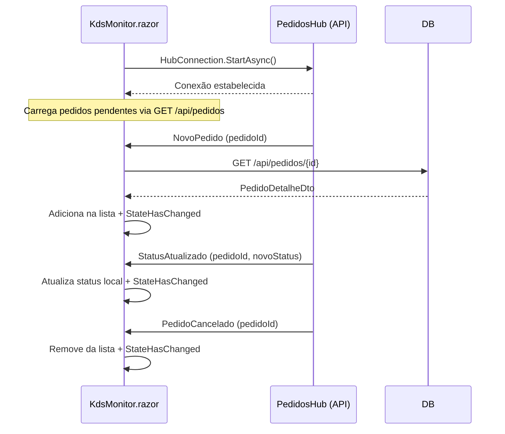

# Fluxograma — BatatasFritas.Web (Blazor WASM)

> Gerado pelo Reversa (Arqueólogo) em 2026-05-01 | Nível: Detalhado

## Mapa de Páginas e Layouts

## Fluxo: CarrinhoState (Estado Global)

## Fluxo: AuthStateProvider (Blazor Auth)

## Fluxo: KdsMonitor (SignalR ao vivo)

