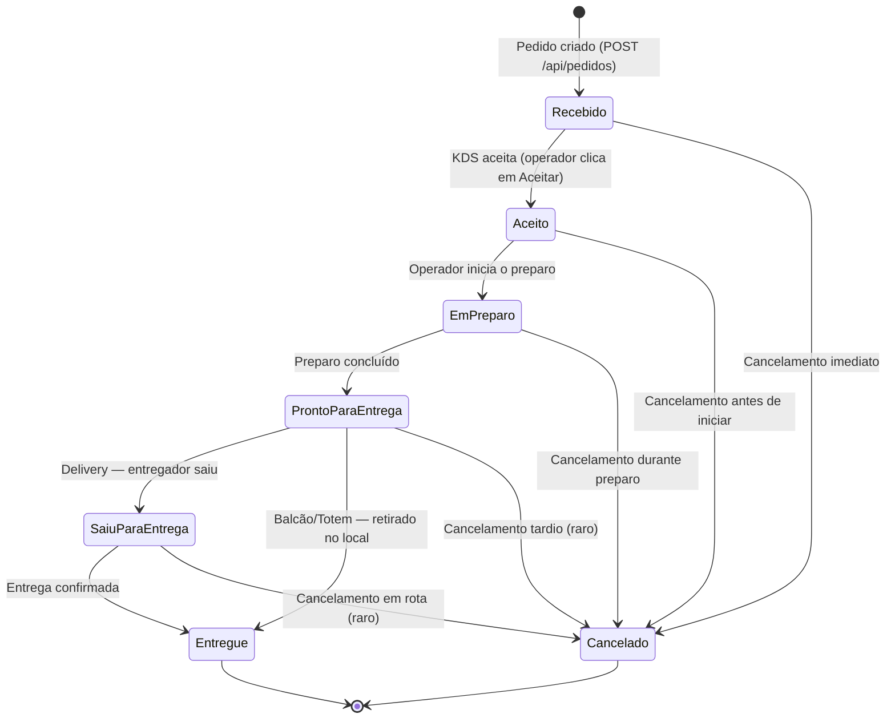
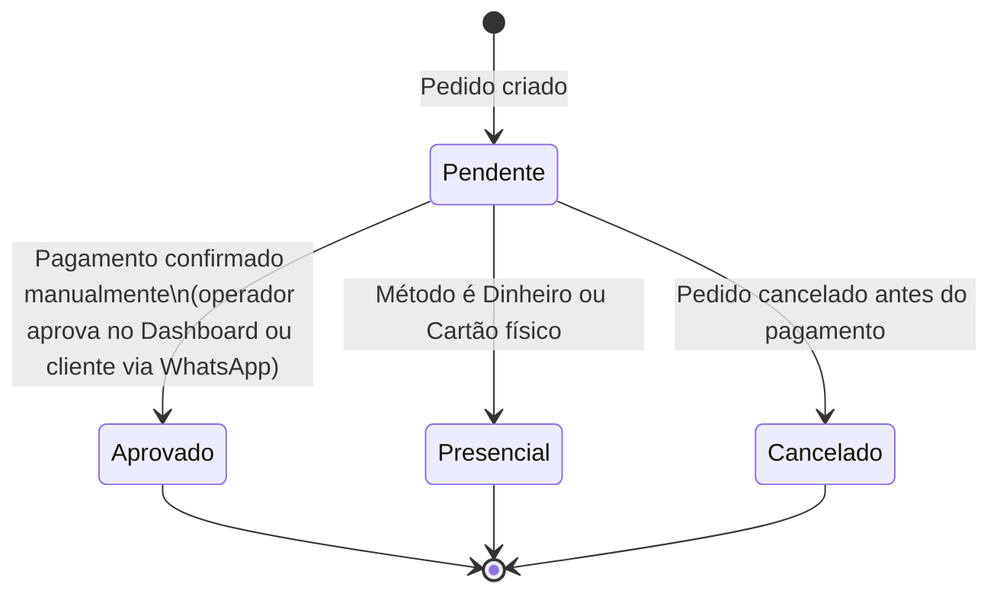
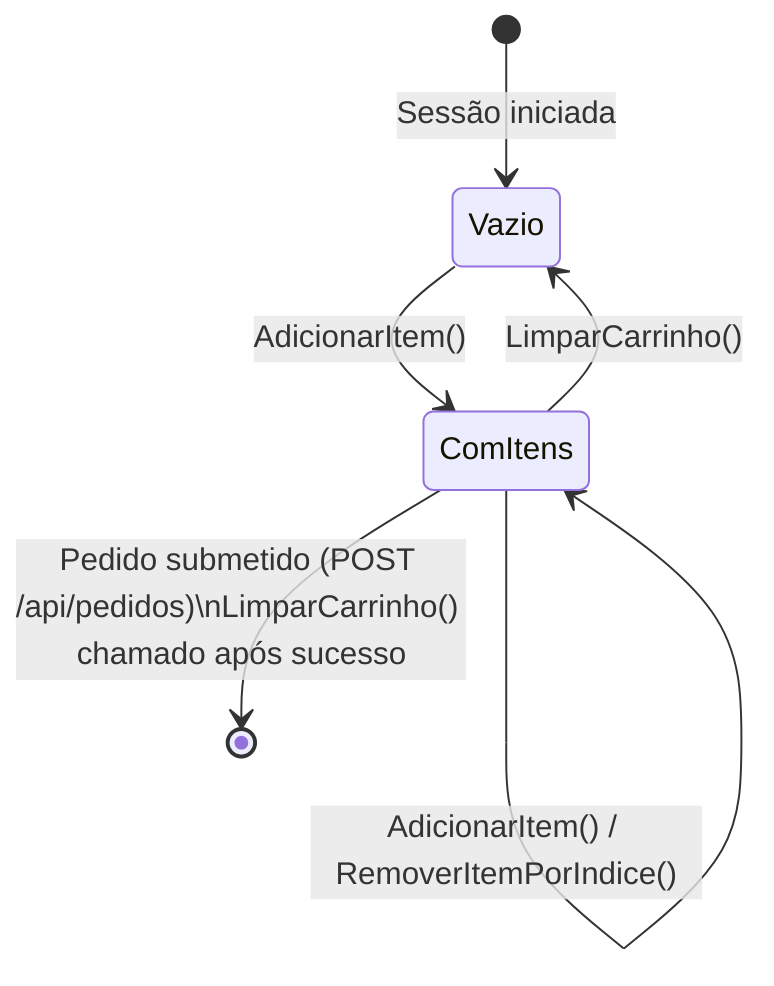

# Máquinas de Estado — BatatasFritas

> Gerado pelo Reversa (Detetive) em 2026-05-01 | Nível: Detalhado

---

## Pedido.StatusPedido

### Transições Válidas (Pedido.CanTransition())

| De | Para | Gatilho | Permitido |
|---|---|---|---|
| Recebido | Aceito | PATCH /api/kds/{id}/status | ✅ |
| Recebido | Cancelado | PATCH /api/kds/{id}/cancelar | ✅ |
| Aceito | EmPreparo | PATCH /api/kds/{id}/status | ✅ |
| Aceito | Cancelado | PATCH /api/kds/{id}/cancelar | ✅ |
| EmPreparo | ProntoParaEntrega | PATCH /api/kds/{id}/status | ✅ |
| EmPreparo | Cancelado | PATCH /api/kds/{id}/cancelar | ✅ |
| ProntoParaEntrega | SaiuParaEntrega | PATCH /api/kds/{id}/status | ✅ |
| ProntoParaEntrega | Entregue | PATCH /api/kds/{id}/status | ✅ |
| ProntoParaEntrega | Cancelado | PATCH /api/kds/{id}/cancelar | ✅ |
| SaiuParaEntrega | Entregue | PATCH /api/kds/{id}/status | ✅ |
| SaiuParaEntrega | Cancelado | PATCH /api/kds/{id}/cancelar | ✅ |
| Entregue | * | (Terminal state) | ❌ |
| Cancelado | * | (Terminal state) | ❌ |

🟢 **FASE 3.5:** State machine validation now enforced in Domain via `Pedido.CanTransition()`. Invalid transitions are blocked at the application layer.

---

## Pedido.StatusPagamento

### Notas

🟢 **FASE 3.5 (Atual):** Fluxo manual somente. MercadoPago removido. Pagamentos aprovados por:
  - **Delivery:** Operador verifica comprovante Pix via WhatsApp, clica "Aprovar" no Dashboard
  - **Totem/Balcão:** Operador recebe Order#, digita no caixa, clica "Aprovar" no Dashboard

🟢 `Presencial (valor=10)` é um estado especial para pedidos cujo pagamento é dinheiro/cartão físico — não passa por nenhum sistema de pagamento online.

🟡 **Retentativa de pagamento:** Não implementada. Se cliente não envia comprovante, operador não aprova e pedido permanece em `Pendente`.

🟡 **InfinitePay (FASE 4):** Quando credenciais forem disponíveis, nova máquina de estado será implementada com suporte a webhooks e retry automático.

---

## CarrinhoState (Frontend — Blazor)

> Não é persistido. Estado em memória do cliente durante a sessão de navegação.

