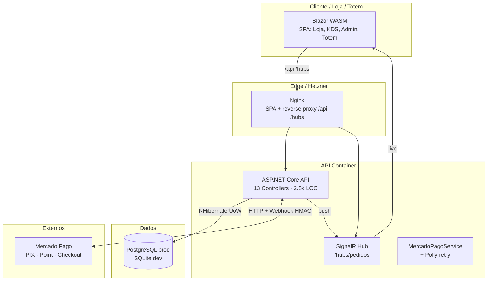
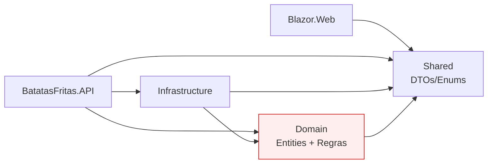

# Architecture Audit — BatatasFritas (Palheta Brutal)
> **Modo:** AVALIAR + UPGRADE
> **Data:** 2026-04-25
> **Escopo:** arquitetura, engenharia, segurança, integrações, design, operacional
> **Stack:** .NET 8 · ASP.NET Core · Blazor WASM · NHibernate 5.5 · SignalR · JWT · SQLite/PostgreSQL · Mercado Pago · Docker · Hetzner/Coolify

---

## A. Mapa do Estado Atual



**Camadas (Clean Architecture):**



⚠️ **Domain → Shared** = violação clássica de Clean Architecture (Domain não deve depender de nada). Detalhado adiante.

---

## B. Score de Qualidade Arquitetural

| Dimensão | Nota | Observação |
|----------|------|-----------|
| **Manutenibilidade** | 3/5 | Camadas bem separadas; AdminPanel.razor com 1550 LOC é god-component; controllers grandes (Financeiro 434, Pedidos 323) |
| **Escalabilidade** | 2.5/5 | SQLite default; `SchemaUpdate` em prod; sem cache; `GetAllAsync()` em hot paths; sessão NHibernate sem readonly |
| **Observabilidade** | 1.5/5 | `ILogger` parcial; `Console.WriteLine` em Program.cs/DI; sem métricas; healthcheck = literal `"OK"`; sem traces |
| **Segurança** | 2.5/5 | JWT ok; HMAC ok mas opcional; **secrets commitados**; senha PG hardcoded; sem rate limit; CORS dev = `AllowAnyOrigin` |
| **Testabilidade** | 0.5/5 | **Zero projetos de teste** (`.Tests`). NHibernate concreto + `Console.WriteLine` em Infra dificulta mock |
| **Resiliência** | 3/5 | Polly retry no MP ✅; UoW com rollback ✅; sem circuit breaker; sem DLQ no webhook |
| **DevOps/CI-CD** | 1.5/5 | Único workflow constrói imagem base; sem build/test/deploy no PR; sem ambiente staging declarativo |
| **Aderência DDD** | 2.5/5 | Entidades ricas ok; mas seed/migração ad-hoc em `Program.cs`; Repository genérico vaza `Expression` na borda |
| **Integração** | 3.5/5 | MP bem feito (HMAC, retry, idempotência por `ExternalPaymentId`); SignalR com JWT via querystring ✅ |
| **UX/Frontend** | 3/5 | Blazor WASM ok; god-pages; estado global em singleton (`CarrinhoState`); CSS não auditado |
| **Total** | **2.4/5** | Sistema funcional em produção, mas com dívida técnica importante e gaps críticos de segurança/operação |

---

## C. Inventário de Dívidas Técnicas (priorizado)

### 🔴 Alta — corrigir AGORA

| # | Problema | Onde | Custo |
|---|----------|------|------|
| 1 | **Secrets em git**: `Jwt:SecretKey` literal commitado em `appsettings.json` | [appsettings.json:14](src/BatatasFritas.API/appsettings.json:14) | <1d |
| 2 | **Senha PostgreSQL hardcoded** `mysecretpassword` em docker-compose | [docker-compose.prod.yml](docker-compose.prod.yml), [docker-compose.yml](docker-compose.yml) | <1d |
| 3 | **`SchemaUpdate` rodando em produção** — pode alterar schema silenciosamente, perder dados | [DependencyInjection.cs:39](src/BatatasFritas.Infrastructure/DependencyInjection.cs:39) | 3-5d (migrar p/ DbUp ou FluentMigrator) |
| 4 | **Migração SQLite-only no Program.cs** (`PRAGMA table_info`) executa em PostgreSQL e falha silenciosa (try/catch engole) | [Program.cs:152-179](src/BatatasFritas.API/Program.cs:152) | 1d |
| 5 | **Senha padrão `palheta2025` ainda hardcoded** no `AuthController.SenhaPadrao` | [AuthController.cs:21](src/BatatasFritas.API/Controllers/AuthController.cs:21) | <1d (env var + obrigar troca no 1º login) |
| 6 | **Sem rate limiting** — endpoint `/api/auth/login` aceita brute-force | [Program.cs](src/BatatasFritas.API/Program.cs) | 1d (`AddRateLimiter` .NET 8) |
| 7 | **CORS dev = qualquer origem com credenciais** — risco se DEV_MODE vazar p/ prod | [Program.cs:108](src/BatatasFritas.API/Program.cs:108) | <1d (alvo de pentests) |
| 8 | **Webhook HMAC opcional** — se `WebhookSecret` vazio, qualquer um pode marcar pedido pago | [PagamentosController.cs:84](src/BatatasFritas.API/Controllers/PagamentosController.cs:84) | <1d (tornar obrigatório em prod) |

### 🟡 Média — próximo sprint

| # | Problema | Onde | Custo |
|---|----------|------|------|
| 9 | **Zero testes automatizados** | projeto inteiro | 5-10d (cobrir Pedido/CarteiraCashback/Financeiro) |
| 10 | **Domain → Shared** — viola Clean (Domain deve ser puro) | [Domain.csproj:3](src/BatatasFritas.Domain/BatatasFritas.Domain.csproj:3) | 2d (mover Enums p/ Domain ou criar `Domain.SharedKernel`) |
| 11 | **Seed em `Program.cs`** misturado com migração e startup | [Program.cs:145-234](src/BatatasFritas.API/Program.cs:145) | 1d (extrair `IDataSeeder`) |
| 12 | **AdminPanel.razor 1550 LOC** = god-component | [AdminPanel.razor](src/BatatasFritas.Web/Pages/AdminPanel.razor) | 3-5d (componentizar por aba) |
| 13 | **DashboardFinanceiro 985 LOC, KdsMonitor 682, Estoque 767** — monolitos de UI | `Pages/*.razor` | 5d |
| 14 | **Healthcheck só retorna `"OK"`** — não verifica DB/MP/SignalR | [Program.cs:143](src/BatatasFritas.API/Program.cs:143) | <1d (`AddHealthChecks().AddNpgSql().AddCheck(...)`) |
| 15 | **Logging inconsistente** — `Console.WriteLine` em Infra/Program | [DependencyInjection.cs](src/BatatasFritas.Infrastructure/DependencyInjection.cs), [Program.cs](src/BatatasFritas.API/Program.cs) | 1d (Serilog estruturado) |
| 16 | **CI sem build/test do .NET** — único workflow só monta imagem base do Blazor | [.github/workflows/](.github/workflows/) | 1-2d |
| 17 | **Sem ambiente staging** — deploy direto pra prod | infra | 2d |
| 18 | **Dois UoW concretos** (`InMemory` + `NHibernate`) sem fábrica clara — risco de wiring errado | [Repositories/](src/BatatasFritas.Infrastructure/Repositories/) | 1d |
| 19 | **Sem paginação** em listas grandes (pedidos, movimentações, despesas) | múltiplos controllers | 2-3d |

### 🟢 Baixa — backlog

| # | Problema | Onde |
|---|----------|------|
| 20 | Arquivos de scaffolding `Class1.cs` (já marcados, deletar fisicamente) | Domain/Infra/Shared |
| 21 | `.tmp`, `node_modules`, `batatasfritas.db` na raiz — sujeira no repo | gitignore review |
| 22 | Múltiplos worktrees commitados em `.claude/worktrees/` |  |
| 23 | Falta `EditorConfig`/análise estática (`Roslynator`, `SonarAnalyzer`) | projeto |
| 24 | `appsettings.Production.json.example` mas sem validação de config no startup |  |

---

## D. Pontos Fortes

1. **Clean Architecture coerente** — Domain/Infra/API/Web/Shared separados, dependências corretas (exceto Domain→Shared).
2. **JWT bem configurado** — issuer/audience/lifetime/HMAC256, com hook para SignalR via `access_token` querystring.
3. **Webhook Mercado Pago com HMAC** — validação de assinatura (`v1=...,ts=...`), defesa em profundidade quando ativada.
4. **Polly retry** com backoff exponencial no `HttpClient` do Mercado Pago.
5. **Repository genérico + UoW** com `FindAsync(Expression)` filtrado no banco.
6. **Healthcheck Postgres no docker-compose** com `service_healthy` antes de subir API.
7. **CORS restritivo em produção** com lista whitelistada.
8. **Logging com `ILogger<T>`** nos controllers principais (Pagamentos).
9. **Documentação rica** — `ANALISE_PROJETO.md`, `ASSINATURA_ARQUITETURAL.md`, `CLAUDE.md` atualizados.
10. **MP idempotente** — pedido localizado por `ExternalPaymentId`.

---

## E. Principais Riscos

### R1 — Comprometimento total da API via JWT secret vazado
`Jwt:SecretKey` está commitado em `appsettings.json` e versionado no git. Qualquer pessoa com acesso ao repo (atual ou futuro funcionário, vazamento, fork) pode forjar tokens válidos para qualquer rota administrativa (financeiro, configurações, KDS). **Probabilidade: alta · Impacto: catastrófico.**

### R2 — Fraude de pagamento via webhook
`WebhookSecret` é opcional. Se ambiente de produção subir sem essa env var (esquecimento, regressão de config), qualquer requisição para `/api/pagamentos/webhook` marca pedidos como pagos. **Probabilidade: média · Impacto: financeiro direto.**

### R3 — Perda de dados em deploy
`SchemaUpdate` do NHibernate gera/altera schema baseado em mappings. Em produção, alterar uma `Map` errada pode dropar/renomear coluna em PostgreSQL sem aviso. Não há backup automático mencionado. **Probabilidade: média · Impacto: alto.**

### R4 — Brute force de senha do operador
`/api/auth/login` sem rate limiting + senha padrão `palheta2025` conhecida + JWT 8h = janela longa de ataque. **Probabilidade: alta · Impacto: alto.**

### R5 — Indisponibilidade silenciosa
Healthcheck retorna literal `"OK"` sem verificar DB ou MP. Coolify/Hetzner consideram saudável mesmo com banco caído. Cliente percebe antes do operador. **Probabilidade: média · Impacto: médio.**

---

## F. Estado Futuro (UPGRADE)

```mermaid
graph TB
    subgraph Cliente
        WebApp[Blazor WASM<br/>+ componentes pequenos]
    end

    subgraph Edge
        Nginx[Nginx + rate limit]
    end

    subgraph Backend
        API[API + RateLimiter<br/>+ HealthChecks ricos<br/>+ Serilog estruturado]
        Hub[SignalR]
        MPSvc[MP Service + Polly]
    end

    subgraph Observ["Observabilidade"]
        Seq[Seq / Loki<br/>logs estruturados]
        Health[/health/live<br/>/health/ready]
    end

    subgraph Data
        PG[(PostgreSQL<br/>+ migrations DbUp)]
        Cache[(Redis<br/>opcional)]
    end

    subgraph CICD["CI/CD"]
        GH[GitHub Actions<br/>build · test · deploy]
        Stage[Staging Hetzner]
        Prod[Prod Hetzner]
    end

    WebApp --> Nginx --> API --> PG
    API --> Cache
    API --> Seq
    API --> Health
    GH --> Stage --> Prod
```

---

## G. Estratégia de Migração

**Abordagem: Strangler Fig + Quick Wins.** Sem big bang. Cada fase entrega valor isolado, reversível, sem mexer em features.

---

## H. Roadmap por Fases

### Fase 0 — Quick Wins (1 dia)
| Ação | Efeito |
|------|--------|
| Mover `Jwt:SecretKey` para env var (`Jwt__SecretKey`) | fecha R1 |
| Tornar `WebhookSecret` obrigatório em prod (validação no startup) | fecha R2 |
| Mover senha PG p/ `.env` (Coolify secrets) + rotacionar | reduz R1 |
| Deletar `Class1.cs` físicos | sujeira |
| Healthcheck básico com `AddHealthChecks().AddNpgSql()` | R5 mitigado |
| Adicionar `.gitignore` p/ `.tmp/`, `*.db`, `bin/`, `obj/` (revisar) | repo limpo |

**Critério de sucesso:** zero secrets em `git ls-files`. `dotnet run` falha se `Jwt:SecretKey` não definido.

### Fase 1 — Fundação de Segurança (3-5 dias)
- `AddRateLimiter()` no `/api/auth/login` (5 tentativas/15min/IP) — fecha R4
- Forçar troca de senha no 1º login (flag `senha_padrao_alterada`)
- HMAC obrigatório em prod (`if (env.IsProduction() && string.IsNullOrEmpty(secret)) throw`)
- Adicionar `[Authorize(Roles="KDS")]` nos controllers admin (já tem `[Authorize]`, falta granularidade)
- Migrar `Console.WriteLine` p/ `ILogger` em Infra
- Auditoria com `git log -p` por secrets já vazados (rotacionar tudo)

### Fase 2 — Engenharia & Testes (5-10 dias)
- Criar `BatatasFritas.Domain.Tests` + `BatatasFritas.API.Tests` (xUnit)
- **Cobertura mínima:** `Pedido.ValorTotal`, `CarteiraCashback.{Debitar,Creditar}`, `RelatoriosController.Faturamento`, fluxo de webhook MP
- Testes de integração com `WebApplicationFactory` + SQLite in-memory
- GitHub Actions: workflow `dotnet build && dotnet test` em todo PR
- Análise estática: `Roslynator` + `SonarAnalyzer.CSharp` no `.csproj`
- Quebrar Domain→Shared: mover `Enums` necessários para Domain (ou criar `SharedKernel`)

### Fase 3 — Migrações Versionadas (3 dias)
- Substituir `SchemaUpdate` por **DbUp** ou **FluentMigrator**
- Pasta `src/BatatasFritas.Infrastructure/Migrations/` versionada
- Tabela `__SchemaVersions` no Postgres
- Backup automático antes de migrar (script no Coolify pré-deploy)
- Remover migração SQLite-only do `Program.cs` (PRAGMA)

### Fase 4 — Observabilidade (3-5 dias)
- **Serilog** com `WriteTo.Console(JsonFormatter)` + sink opcional p/ Seq
- `RequestLogging` middleware
- `/health/live` (proc up) e `/health/ready` (DB + MP reachable)
- Métricas Prometheus opcionais (`OpenTelemetry.Exporter.Prometheus`)
- Painel mínimo: pedidos/min, taxa de webhook ok/falha, latência p95

### Fase 5 — Refactor de UI (5-10 dias, paralelo)
- Quebrar `AdminPanel.razor` em sub-componentes por aba (`<ProdutosTab/>`, `<EstoqueTab/>`, `<UsuariosTab/>`)
- Idem `DashboardFinanceiro`, `KdsMonitor`, `Estoque`
- Extrair lógica de estado pra serviços (`AdminPanelState`) ao invés de code-behind no .razor
- Auditoria CSS (atual não inspecionado em profundidade — ver `design-system` skill na próxima invocação)

### Fase 6 — CI/CD Maduro (3 dias)
- Workflow `ci.yml`: build · test · publish artifact
- Workflow `deploy-staging.yml` em push pra `develop`
- Workflow `deploy-prod.yml` em tag `v*` (manual approval)
- Coolify webhooks ou `ssh` deploy step
- Smoke tests pós-deploy (health + login)

---

## I. Quick Wins (resumo executável)

1. **HOJE:** rotacionar `Jwt:SecretKey`, `WebhookSecret`, senha PG, senha `palheta2025`. Mover tudo p/ env var. `git filter-repo` ou aceitar histórico exposto + rotação.
2. **HOJE:** `dotnet add package AspNetCoreRateLimit` ou `Microsoft.AspNetCore.RateLimiting` → 5 tentativas no login.
3. **AMANHÃ:** healthcheck real `/health/ready` que pinga DB + MP.
4. **ESTA SEMANA:** primeiro arquivo de teste em `BatatasFritas.Domain.Tests` cobrindo `Pedido.ValorTotal` + cashback.
5. **ESTA SEMANA:** workflow `ci.yml` com `dotnet test`.

---

## J. Coisas que faltam e que o projeto deveria ter

| Faltando | Por quê |
|----------|--------|
| **Projeto de testes** | atualmente impossível garantir não-regressão |
| **Migrations versionadas** | `SchemaUpdate` é roleta-russa em prod |
| **Rate limiting** | login + webhook expostos a abuso |
| **Logging estruturado** (Serilog/Seq) | debug em prod = SSH + grep |
| **Healthchecks reais** | indisponibilidade silenciosa |
| **Backups automáticos do PG** | risco de perda total em incidente |
| **Ambiente de staging** | deploy direto na produção é caro em incidentes |
| **`global.json`** fixando SDK 8.x | builds reproduzíveis |
| **`Directory.Build.props`** com `<TreatWarningsAsErrors>true</TreatWarningsAsErrors>` | qualidade compilada |
| **Análise estática (Roslynator/Sonar)** | pega bugs antes do CI |
| **Política de retenção de logs** | LGPD requer prazos definidos |
| **Política de rotação de JWT secret** | comprometimento residual após vazamento |
| **`/api/version` endpoint** | rastrear qual build está em prod |
| **Documentação OpenAPI exportada** (`swagger.json` versionado) | integrações terceiras |
| **Diagrama ER do banco** versionado | onboarding |
| **DLQ ou retry table para webhooks** | falhas transitórias somem hoje |

---

## K. Gaps de Documentação

| Elemento | Sugestão |
|----------|----------|
| Política de backup/restore | adicionar à `ASSINATURA_ARQUITETURAL.md` |
| SLA/SLO de disponibilidade | definir e documentar |
| Runbook de incidente (MP fora, DB cheio, container caído) | criar `RUNBOOK.md` |
| Modelo de ameaças (STRIDE) | criar `THREAT_MODEL.md` |
| Política de versionamento da API | semver no path? `/api/v1/*`? |
| Diagrama de sequência do fluxo Pedido→Pagamento→Cozinha→Entrega | adicionar a este doc |

---

## L. Próximos Passos do Pipeline (CLAUDE.md)

Esta auditoria é o passo 1 (`software-architecture`). Para auditoria completa do projeto, ainda faltam:

| # | Skill | O que cobre que esta auditoria não cobriu |
|---|-------|------------------------------------------|
| 2 | `design-system` | Auditoria CSS, Blazor componentes, tokens, consistência visual |
| 3 | `revisor-gramatical` | Textos PT-BR visíveis (Pages/*.razor, mensagens de erro) |
| 4 | `security-review` | Pentest leve: XSS, SQLi via NHibernate.Linq, JWT replay, CSRF |
| 5 | `sandeco-maestro` | Consolidação final + plano executável priorizado |

Quer que eu invoque a próxima skill (`design-system`) ou prefere agir nos Quick Wins primeiro?
